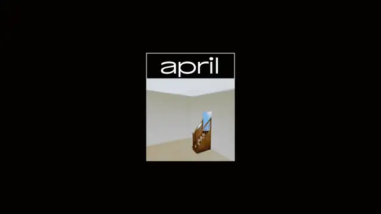
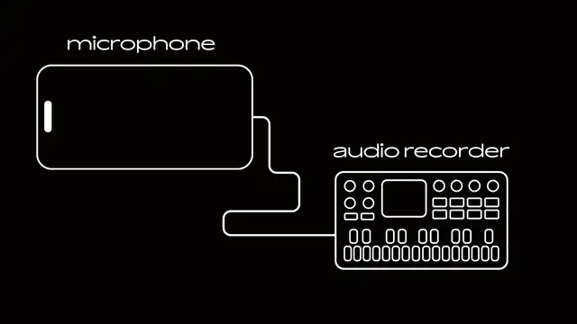

  

<h1 align="center">April OS</h1>

  <a href="#what-is-april">WHAT IS APRIL?</a> ·
  <a href="#features">FEATURES</a> ·
  <a href="#navigation-controls">NAVIGATION CONTROLS</a> ·
  <a href="#setup">SETUP</a> ·
  <a href="#questions">QUESTIONS</a> ·
  <a href="#fork--credits">FORK & CREDITS</a> ·
  <a href="#license">LICENSE</a>

## WHAT IS APRIL?

<table>
<tr>
<td>

This custom firmware for the MVAVE FM-1 attempts to emulate the simplicity of the Casio SK-1 sampler keyboard. There are no synth engines on this firmware, only samples. Everything from the UI to the sound has been made to feel simple and easy to understand.

<a href="https://beashoko.github.io/april-os/"><strong>Check the website out here</strong></a>

April OS needed the FM-1 to have a microphone to work. The one microphone that every one has is the one you’re probably using right now, an iPhone/Laptop.

<strong>*MICROPHONE RECORDING FEATURE SUPPORTS ANY COMPUTER, LAPTOP, OR IPHONE 15 (and above). ANDROID IS NOT SUPPORTED.</strong>

<h3 align="center">HOW IT WORKS</h3>

  

</td>
</tr>
</table>

## FEATURES

  

- 32 available sample spaces,
- 3 seconds worth each sample.
- 8 track sequencer.
- Sophisticated sample and loop editor.
- Built in audio recording function.

## NAVIGATION CONTROLS

| Control | Action |
| --- | --- |
| **SELECT KNOB** | Flip through pages |
| **ALGORITHM KNOB** | Scroll through lists or tracks |
| **KNOBS 1 - 4** | Edit parameters (they always control the colored boxes) |
| **SEL** | Selecting (Obviously) |

Holding SEL on a track in HOME will allow you to change the track color or name

## SETUP

### INSTALLATION

| Step | Instruction |
| :---: | --- |
| **1** | Go to the website on your computer or laptop <a href="https://beashoko.github.io/april-os/">https://beashoko.github.io/april-os/</a> |
| **2** | Connect your FM-1 and click install inside the installation section |
| **3** | Make sure to not disconnect the cable while installing |
| **4** | Wait until the April boot screen appears and you're ready to go |

### MICROPHONE SETUP

| Step | Instruction |
| :---: | --- |
| **1** | Make sure your device is supported (Any PC, Laptop, iPhone 15 and above) |
| **2** | Go to the website <a href="https://beashoko.github.io/april-os/">https://beashoko.github.io/april-os/</a> |
| **3** | If you’re on your phone, only the microphone setup box will appear |
| **4** | Choose your preferred microphone on the input |
| **5** | Choose the FM-1 on the output |
| **6** | Click bridge |
| **7** | Check the grey bar to see if audio input is working |
| **8** | Now on the FM-1 click the REC button |
| **9** | Check the red bar to the right to see if audio input is being captured |
| **10** | Click the REC button again to start recording, a countdown will begin |
| **11** | After recording, press PLAY/STOP to preview the sample |
| **12** | The four knobs correspond to the four modules at the bottom, turn KNOB 3 to save. |

> If nothing recorded, try refreshing the website and repeating from step 1.

## QUESTIONS

### Are you going to add more features?

I really want this firmware to be as simple as it can be. Many firmwares that are coming out right now have been trying to pack as many features into one packag, im trying my best to not make this firmware bloated. Features still may be added in the future if they fit.

### Why can't I just plug in a USB-C Microphone?

The FM-1 does not have the wiring to output power through its USB-C, meaning any microphone that connects to the FM-1 will not be able to work.

### Why is Android not supported?

The way android works with input and output on web browsers makes the bridging functionality not work. I’d have to make an entire android application to fully utilize the microphone. Downloading an app defeats the purpose of my firmware which aims to be as simple and hassle free as possible.

## FORK & CREDITS

This project is a fork of [Felucca](https://github.com/hugelton/Felucca) by **Hügelton Instruments / Leo Kuroshita (@kurogedelic)**.

Felucca is licensed under **GNU GPL v3.0 only (GPL-3.0-only)**. Original Felucca copyright and third-party notices remain with their respective authors.

## LICENSE

Because April OS is a derivative of Felucca, the Felucca-derived code must remain under **GPL-3.0-only** when distributed. See the [Felucca licensing information](https://github.com/hugelton/Felucca/blob/main/LICENSING.md) for upstream licensing and third-party notices.

## TRADEMARK NOTICE

**M-VAVE** and **FM-1** are trademarks of their respective owners. April is independent firmware and is not affiliated with, endorsed by, or supported by those owners.
